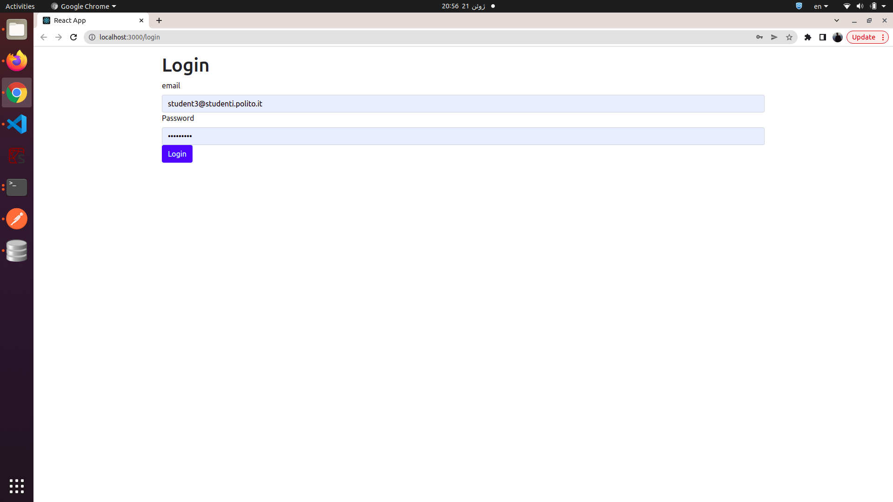
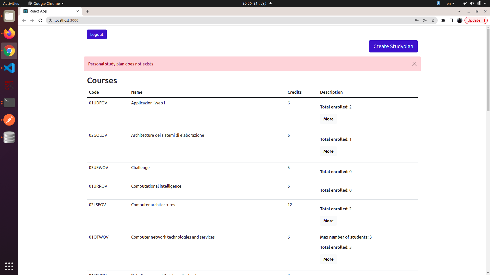
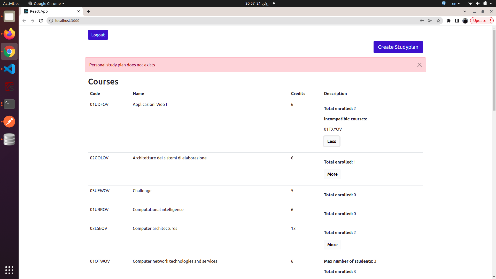
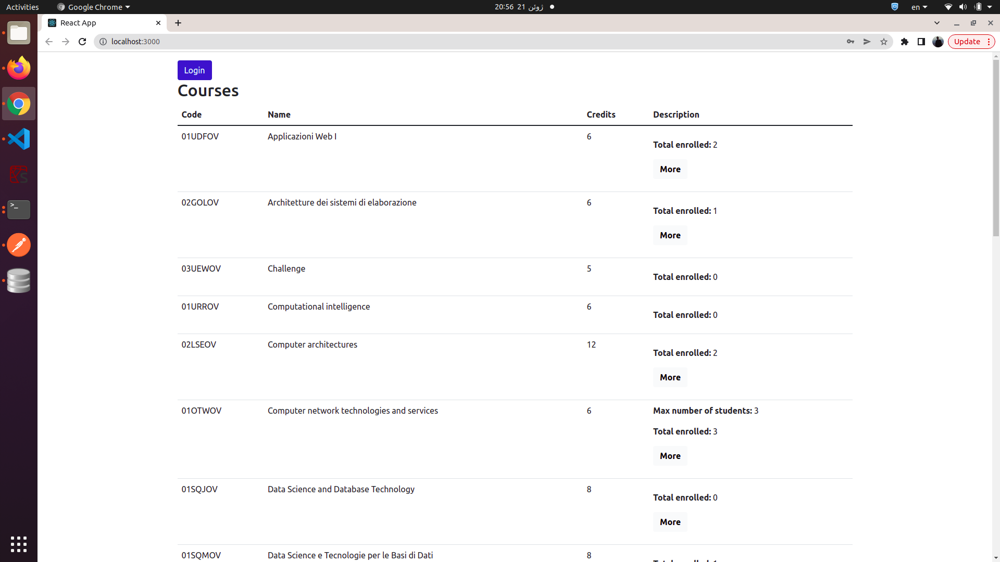
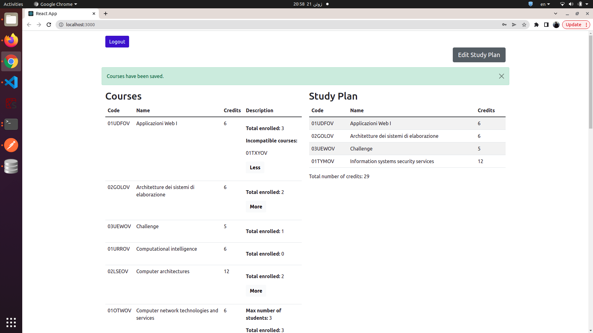
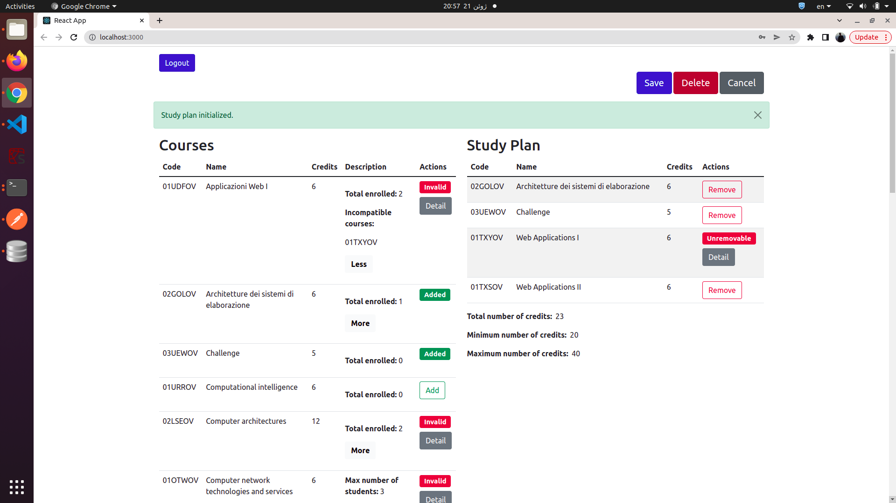
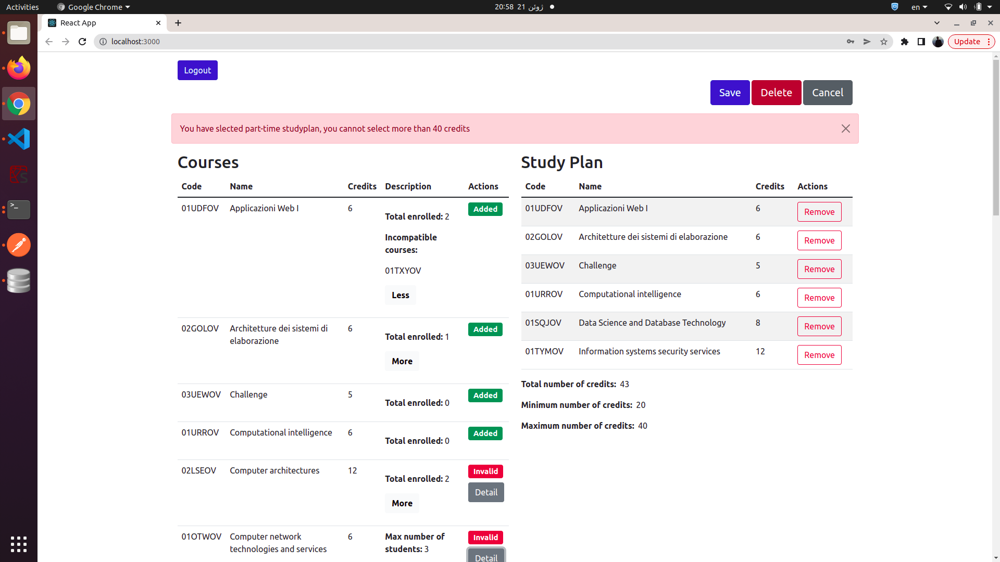
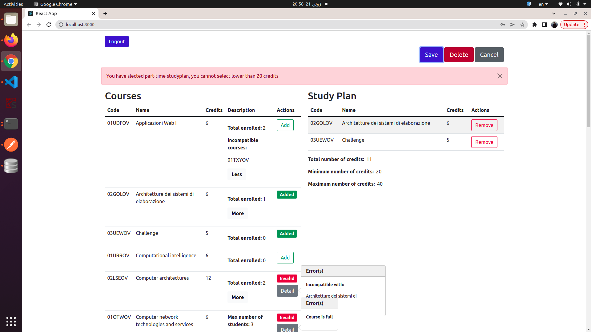
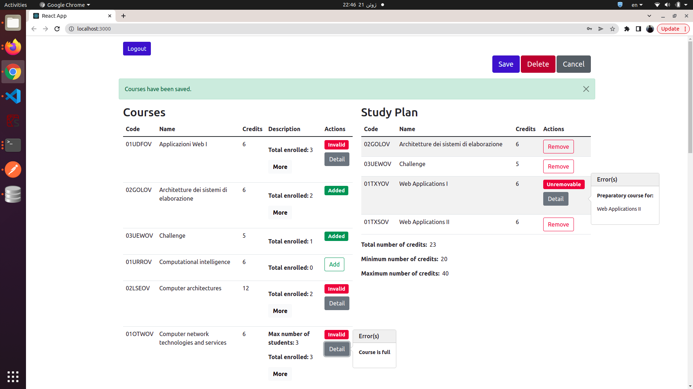
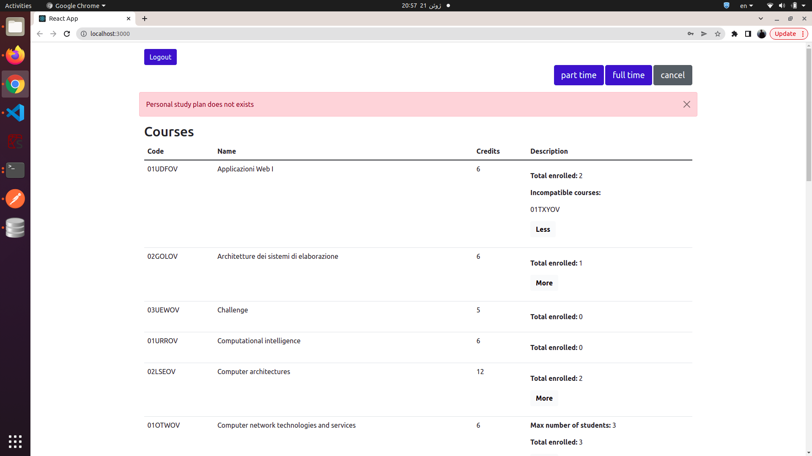

# Exam #1: "Studyplan"
## Student: s300909 FARMAHINI FARAHANI AHMADREZA

## React Client Application Routes

- Route `/`: the main home page of the application including list of courses and, if exists, list of studyplan
- Route `/login`: the login page for students

## API Server
### <ins>StudyPlan APIs</ins>
#### **POST `/api/studyplans/:id`**

- **Creating the studyplan that corresponds to the user ID.**
- **Request header** : req.params.id to retrieve id
- **Request body**: a JSON object containing the courses codes to be added in studyplan table.

    ```
        {
            "codes" : ["01URROV", "02GOLOV", "01UDFOV", ...]
        }
    ```


- **Response header**:  `201 Created` (success). 
- **Response body**: none.
- **Error responses**: `401 Unauthorized` (not logged in or wrong permissions), `503 Service Unavailable` (generic error).


#### **GET `/api/courses`**

- **Return an array containing all courses**.
- **Request body**: empty.
- **Response**: `200 OK` (success); body: An array of objects, each describing code, name, credits, maxstudents, incourses precourses and enrolled students of a the course

    ```
    [
            {
                  "code": "03UEWOV",
                  "name": "Challenge",
                  "credits": 5,
                  "maxstudents": null,
                  "incourses": null,
                  "precourses": null,
                  "enrolled": 4
            },
            {
                  "code": "01UDFOV",
                  "name": "Applicazioni Web I ",
                  "credits": 6,
                  "maxstudents": null,
                  "incourses": "01TXYOV",
                  "precourses": null,
                  "enrolled": 6
            },
            ...
                
    ]

    ```

- **Error responses**:  `401 Unauthorized` (not logged in or wrong permissions), `500 Internal Server Error` (generic error).


#### **GET `/api/studyplan/:id`**

- **Return an array containing the specific studyplan corresponding to user id**.
- **Request header** : req.params.id to retrieve id
- **Request body**: empty.
- **Response**: `200 OK` (success); body: An array of objects, each describing code, name, credits, maxstudents, incourses(incompatible courses), precourses(preparatory courses) and enrolled students of a the course

    ```
    [
            {
                  "code": "03UEWOV",
                  "name": "Challenge",
                  "credits": 5,
                  "maxstudents": null,
                  "incourses": null,
                  "precourses": null,
                  "enrolled": 4
            },
            {
                  "code": "01UDFOV",
                  "name": "Applicazioni Web I ",
                  "credits": 6,
                  "maxstudents": null,
                  "incourses": "01TXYOV",
                  "precourses": null,
                  "enrolled": 6
            },
            ...
                
    ]

    ```

- **Error responses**:  `401 Unauthorized` (not logged in or wrong permissions), `500 Internal Server Error` (generic error).


#### **PUT `/api/addenrolled`**

- **Modifying number of enrolled students.**
- **Request header** has a line: `Content-Type: application/json`
- **Request body**: a JSON object containing the courses codes to be increased in database.


Example of Request body

    {
        "codes" : ["01URROV", "02GOLOV", "01UDFOV", ...]
    }


- **Response header**:  `200 OK` (success). 
- **Response body**: none.
- **Error responses**: `401 Unauthorized` (not logged in or wrong permissions)


#### **PUT `/api/removeenrolled`**

- **Modifying number of enrolled students.**
- **Request header** has a line: `Content-Type: application/json`
- **Request body**: a JSON object containing the courses codes to be reduced in database.


Example of Request body

    {
        "codes" : ["01URROV", "02GOLOV", "01UDFOV", ...]
    }


- **Response header**:  `200 OK` (success). 
- **Response body**: none.
- **Error responses**: `401 Unauthorized` (not logged in or wrong permissions)


#### **DELETE `/api/studyplan/:id`**

- **Delete a StudyPlan with receiving its user id.**
- **Request header** : req.params.id to retrieve id
- **Request body**: none
- **Response header**:  `204 No Content` (success).
- **Response body**: none.
- **Error responses**: `401 Unauthorized` (not logged in or wrong permissions), `503 Service Unavailable` (generic error).


### <ins>User APIs</ins>


#### **POST `/api/sessions`**

- **Creating new credentials in sessions**
- **Request body**: a JSON object containing of the student/user credentials to be authenticated.

    ```
        {
            "username": "student1@studenti.polito.it",
            "password": "password"
        }
    ```


- **Response header**:  `201` (success). 
- **Response body**: none.


#### **GET `/api/sessions/current`**

- **Return an object of student/user's credentials.**
- **Request header** : empty.
- **Request body**: empty.
- **Response**: `200 OK` (success); body: An object, which describing id, username, name and type of the user.

    ```
      {
          "id": 1,
          "username": "student1@studenti.polito.it",
          "name": "Ahmadreza",
          "type": null
      }

    ```

    
#### **PUT `/api/user/:id`**

- **Modifying the type of student's studyplan in user table**
- **Request header** : req.params.id to retrieve id
- **Request body**: a JSON object containing the type of the students studyplan.


Example of Request body

    {
        "type" : "part-time"
    }


- **Response header**:  `200 OK` (success). 
- **Response body**: empty.
- **Error responses**: `401 Unauthorized` (not logged in or wrong permissions), `503 Service Unavailable` (generic error).


#### **DELETE `/api/sessions/current`**

- **Delete current user's info.**
- **Request header** : none
- **Request body**: none
- **Response header**:  `204` (success).
- **Response body**: none.


## Database Tables

- Table `course` - contains code name credits enrolled
- Table `studyplan` - contains studentid coursecode
- Table `incompatibe` - contains code incourses
- Table `preparatory` - contains code precourses
- Table `max` - contains code maxstudents
- Table `user` - contains id email password type salt name

## Main React Components

- `LoginForm` (in `./componnents/AuthComponents.js`): Used in log in page and will handle login with Passport module
- `LogoutButton` (in `./componnents/AuthComponents.js`): Log out button on homepage for logging out to the homepage
- `LoginButton` (in `./componnents/AuthComponents.js`): Log in button on homepage for student to access/create studyplan
- `CreateButton` (in `./componnents/ControlButtons.js`): For creating new study plan, on click it will show typeButton
- `EditButton` (in `./componnents/ControlButtons.js`): Edit button will change the mode to edit view where student can edit studyplan
- `SaveButtons` (in `./componnents/ControlButtons.js`): This button will be shown on edit mode and student can save the studyplan with this button
- `TypeButton` (in `./componnents/ControlButtons.js`): This button will be shown after student click on createButton and can choose the type of the course
- `CoursesRow` (in `./componnents/CourseRow.js`): Used for adding new rows to the course table and consists of CoursesData and CoursesAction
- `CoursesData` (in `./componnents/CourseRow.js`): Used for adding data for each row in course table
- `CoursesActions` (in `./componnents/CourseRow.js`): Consist of add/added/invalid/detail buttons in editing mode on courses table  and in the actions column
- `CoursesTable` (in `./componnents/CourseTable.js`): Main component for showing the courses in the table, it will uses CoursesRow for each row to maintain the data
- `ExpandControl` (in `./componnents/ExpandControl`): Used for expanding description of each course in courses table
- `ExpandPreparatory` (in `./componnents/ExpandCourses.js`): Details related to preparatory courses and will be shown after ExpandControl(more) clicked
- `ExpandIncompatible` (in `./componnents/ExpandCourses.js`): Details related to incompatible courses and will be shown after ExpandControl(more) clicked
- `MaxStudent` (in `./componnents/ExpandCourses.js`): Details related to max students on each courses and will be shown after ExpandControl(more) clicked
- `InvalidDetailStudyPlan` (in `./componnents/InvalidButtons.js`): Details on invalid courses for removing from the studyplan, on click it shows details
- `InvalidDetail` (in `./componnents/InvalidButtons.js`): Details on invalid courses for adding to the studyplan, on click it shows details
- `HomeRoute` (in `./componnents/Routers.js``): Home route of the application that will be shown on logged in and logged out
- `LoginRoute` (in `./componnents/Routers.js``): Login route of the application that user have tu put username and passsport for redirecting to homepage
- `StudyPlanRow` (in `./componnents/StudyplanRow.js`): Used for adding new rows to the studyplan table and consists of StudyPlanData and StudyPlanActions
- `StudyPlanData` (in `./componnents/StudyplanRow.js`): Used for adding data for each row in studyplan table
- `StudyPlanActions` (in `./componnents/StudyplanRow.js`): Consist of remove/invalid/detail buttons in editing mode on studyplan table
- `StudyPlanTable` (in `./componnents/StudyplanTable.js`): Main component for showing the studyplan table, it will uses StudyplanRow for each row to maintain the data
- `App` (in `./App.js`): Main component that handle all actions and other components, also it has local storage for states so states will not be lost on refresh


## Screenshot
##### LogIn Route


##### Home Route/ StudyPlan does not exist





##### Home Route/ StudyPlan exist


##### Home Route/ StudyPlan is in edit mode





##### Home Route/ StudyPlan is in choose mode



## Users Credentials

- username: student1@studenti.polito.it, password1, type: part-time, name: Ahmadreza
- username: student2@studenti.polito.it, password2, type: full-time, name: Dario
- username: student3@studenti.polito.it, password3, type: Null , name: Marie
- username: student4@studenti.polito.it, password4, type: Null , name: Silvan
- username: student5@studenti.polito.it, password5, type: Null , name: Gwladis
